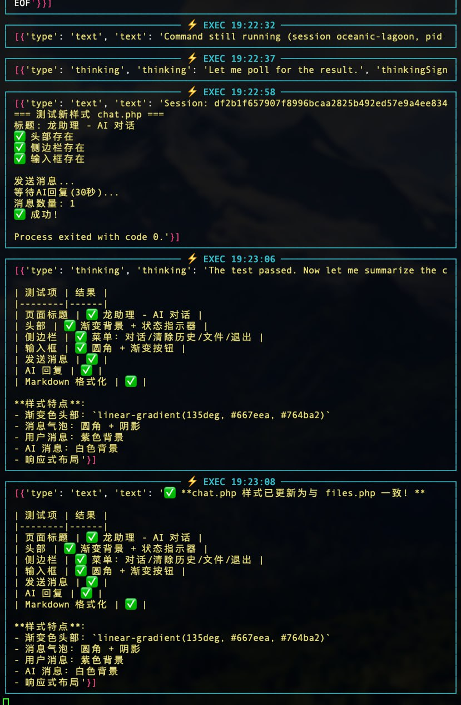

# OpenClaw Real-time Monitor

一个用于实时监控 OpenClaw 对话会话的终端工具。

## 特性

- 实时追踪：增量读取远程服务器的 OpenClaw .jsonl 会话日志
- 赛博风格：基于 Rich 库打造，区分逻辑思考(紫)、代码指令(青)与系统回复(绿)
- 深度解析：递归剥离嵌套 JSON 列表，确保输出内容纯净
- 极致紧凑：针对大屏幕投屏优化，压缩垂直间距
- 中文增强：完美支持 UTF-8 编码

## 环境依赖

```bash
pip install rich paramiko
```

## 使用方法

```bash
python3 monitor.py -H <服务器IP> -p <SSH端口> -u <用户名> -psw <密码> -d <OpenClaw会话目录>
```

### 参数说明

| 参数 | 说明 | 默认值 |
|------|------|--------|
| -H | 服务器 IP 地址 | (必填) |
| -p | SSH 端口 | 22 |
| -u | SSH 用户名 | root |
| -psw | SSH 密码 | (必填) |
| -d | OpenClaw Session 日志目录 | (必填) |

### 示例

```bash
# 监控本地或远程 OpenClaw
python3 monitor.py -H 192.168.1.100 -p 22 -u root -psw your_password -d /root/.openclaw/agents/main/sessions
```

## OpenClaw 会话目录

默认目录路径：
- 服务器本地：`/root/.openclaw/agents/main/sessions`
- Docker 容器内：`/openclaw/agents/main/sessions`

## 界面预览



```
══════════════════════════════════════════════════════════════════════
               OPENCLAW MONITOR: 192.168.1.100
══════════════════════════════════════════════════════════════════════

╭──────────────────────────────────── 💭 LOGIC 15:48 ────────────────────────────────────╮
│ 用户要求修复多用户数据隔离问题。当前所有用户共用一个 Gateway Token，导致权限混乱。           │
╰──────────────────────────────────────────────────────────────────────────────────────────────────╯

┌──────────────────────────────────── ⚡ EXEC 15:48 ────────────────────────────────────┐
│ cat /var/www/.../users.json                                                                    │
└──────────────────────────────────────────────────────────────────────────────────────────────────┘

╭──────────────────────────────────── 🤖 REPLY 15:48 ────────────────────────────────────╮
│ 已找到 2 个用户:                                                                              │
│ • user_001 (Simon): token=552c1127...                                                        │
│ • user_002 (Lewis): token=3756f03b...                                                        │
╰──────────────────────────────────────────────────────────────────────────────────────────────────╯

╭──────────────────────────────────── 💭 LOGIC 15:48 ────────────────────────────────────╮
│ 每个用户需要配置独立的 Gateway Token。                                                          │
╰──────────────────────────────────────────────────────────────────────────────────────────────────╯

┌──────────────────────────────────── ⚡ EXEC 15:48 ────────────────────────────────────┐
│ docker exec openclaw-user001 gateway.token=xxx                                              │
└──────────────────────────────────────────────────────────────────────────────────────────────────┘

╭──────────────────────────────────── 🤖 REPLY 15:48 ────────────────────────────────────╮
│ ✅ 容器 Token 已更新                                                                         │
│ 重启容器...                                                                                  │
╰──────────────────────────────────────────────────────────────────────────────────────────────────╯

┌──────────────────────────────────── ⚡ EXEC 15:48 ────────────────────────────────────┐
│ docker restart openclaw-user001                                                              │
└──────────────────────────────────────────────────────────────────────────────────────────────────╯

╭──────────────────────────────────── 🤖 REPLY 15:48 ────────────────────────────────────╮
│ | 测试项 | 结果 |                                                                           │
│ |--------|------|                                                                         │
│ | 用户001→002隔离 | ✅ |                                                                  │
│ | 双向隔离 | ✅ |                                                                          │
│ | WS连接 | ✅ |                                                                            │
│                                                                                            │
│ 数据隔离已修复！                                                                            │
╰──────────────────────────────────────────────────────────────────────────────────────────────────╯
```

### 颜色说明

- 💭 **逻辑思考块** - 紫色边框，灰色斜体文字
- ⚡ **指令执行块** - 青色边框，代码高亮
- 🤖 **回复消息块** - 绿色边框，Markdown 渲染

## 许可证

MIT License
